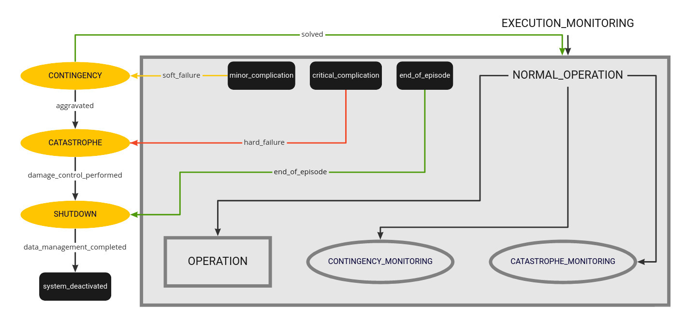
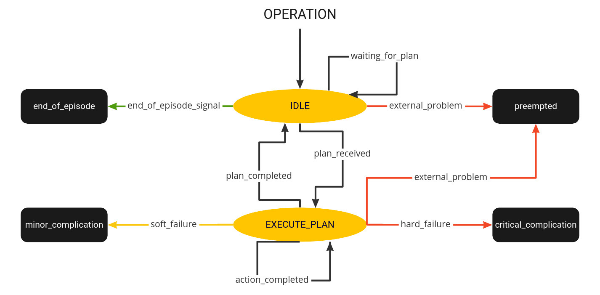

# Execution Monitoring Node

**High-level state machine providing plan execution and monitoring for LTA plant observation with a mobile robot.**

## Dependencies

- [plan_generation](https://github.com/tbohne/plan_generation): `main`
- [arox_navigation_flex](https://git.ni.dfki.de/arox/arox_core/arox_navigation_flex): `feature_msc_setup_tim`
- [arox_performance_parameters ](https://git.ni.dfki.de/arox/arox_core/arox_performance_parameters): `feature_performace_parameters`

## Usage

- **manual:**
    - run high-level execution monitoring state machine: `rosrun execution_monitoring high_level_smach.py`
    - run action server providing the dummy scanner: `rosrun execution_monitoring dummy_scanner.py`
    - run fake RIEGL publisher (republishes Velodyne): `rosrun execution_monitoring fake_riegl_pub.py`
- **with launch file (including plan generation)**:
    - `roslaunch execution_monitoring execution_monitoring.launch`

## Simulate LTA problems

- **sensor failure:** `rostopic pub -1 /simulate_sensor_failure std_msgs/String fail`

## Monitoring States

- manually trigger *CONTINGENCY* or *CATASTROPHE*:
    - **contingency detected**: `rostopic pub -1 "/contingency_preemption" std_msgs/String contingency`
    - **catastrophe detected**: `rostopic pub -1 "/catastrophe_preemption" std_msgs/String catastrophe`

## Visualize State of Hierarchical SMACH

`rosrun smach_viewer smach_viewer.py`

## Architecture

- high level: 
- low level: 
