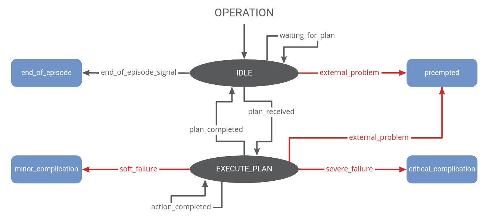

# Execution Monitoring Framework


[](https://opensource.org/licenses/MIT)

Fully integrated plan execution, monitoring and resolution framework capable of overcoming some of the typical limitations of long-term autonomous mobile outdoor robots. Detailed background information is available in my [**master's thesis**](https://github.com/tbohne/msc), in the context of which this framework was developed.

## General Dependencies

- [**plan_generation**](https://github.com/tbohne/plan_generation):  ROS node that generates / provides action plans based on CSV data
- [**mongodb_store**](https://wiki.ros.org/mongodb_store): MongoDB tools for storing and analyzing runs of ROS systems
    - *when using the logging component*
- [**pointcloud_to_laserscan**](https://wiki.ros.org/pointcloud_to_laserscan): Converts 3D point clouds into 2D laser scans
    - *when working with `PointCloud2`*
- [**psutil**](https://pypi.org/project/psutil/): Cross-platform library for process and system monitoring in Python
    - *for data management monitoring*
- [**speedtest-cli**](https://pypi.org/project/speedtest-cli/): Command line interface for testing internet bandwidth using *speedtest.net*
    - *for internet connection monitoring*
- [**PyOWM**](https://pypi.org/project/pyowm/): Python wrapper around *OpenWeatherMap* API
    - *for weather monitoring*
    - *set up `src/execution_monitoring/secret_config.py` containing `OWM_API_KEY = YOUR_OWM_API_KEY`*

## Dependencies for the Prototype Scenario in the Simulation

- [**arox_docker**](https://git.ni.dfki.de/arox/arox_docker): Dockerization of the AROX (Autonomous Robotic Experimentation Platform)
    - branch: `noetic`
    - *packages and compatible branches within the docker container:*
        - [**arox_navigation_flex**](https://git.ni.dfki.de/arox/arox_core/arox_navigation_flex): `feature_msc_setup_tim`
        - [**arox_launch**](https://git.ni.dfki.de/arox/arox_core/arox_launch): `feature_msc_setup_tim`
        - [**arox_indoor_navi**](https://git.ni.dfki.de/arox/arox_core/arox_indoor_navi): `sim_launch_detection_config`
        - [**arox_engine**](https://git.ni.dfki.de/arox/arox_core/arox_engine): `feature_lta_engine`
        - [**arox_performance_parameters**](https://git.ni.dfki.de/arox/arox_core/arox_performance_parameters): `feature_msc_setup_tim`
        - [**map_langsenkamp**](https://git.ni.dfki.de/zla/map_langsenkamp): `feature_lta_map`
        - [**arox_docking**](https://git.ni.dfki.de/arox/arox_core/arox_docking): `feature/python2_compatible`
- [**arox_description**](https://git.ni.dfki.de/arox/arox_core/arox_description): ROS launch files and URDF model for the AROX system
    - branch: `feature_msc_setup_tim`
- [**container_description**](https://git.ni.dfki.de/arox/container_description): ROS launch files and URDF model for the mobile container (charge station)
    - branch: `feature_msc_setup_tim`
- [**innok_heros_description**](https://git.ni.dfki.de/arox/innok_heros/innok_heros_description): URDF description for Innok Heros robot
    - branch: `arox_noetic`
- [**innok_heros_driver**](https://git.ni.dfki.de/arox/innok_heros/innok_heros_driver): ROS driver for the Innok Heros robot platform
    - branch: `master`
- [**velodyne_simulator**](https://bitbucket.org/DataspeedInc/velodyne_simulator/src/master/): URDF and gazebo plugin to provide simulated data from Velodyne laser scanners
    - branch: `master`
- [**gazebo_langsenkamp**](https://git.ni.dfki.de/zla/gazebo_langsenkamp): Langsenkamp world (test field)
    - branch: `feature_msc_setup_tim`
- [**hector_gazebo_plugins**](https://wiki.ros.org/hector_gazebo_plugins): contains a 6wd differential drive plugin, an IMU sensor plugin, an earth magnetic field sensor plugin, a GPS sensor plugin and a sonar ranger plugin
    - install: `apt-get install ros-noetic-hector-gazebo`

### Gazebo Models

[Models](https://cloud.dfki.de/owncloud/index.php/s/TBCzjPfZbzEpMfa) to be placed in `/.gazebo/models/`:
- `charger_ground_patch`, `Corn`, `langsenkamp_simulation`, `Pillar_1`
- additionally: `stop_sign` and `jersey_barrier` from the `/models` directory of this repository

## Usage - Prototype Scenario in the Simulation

- run simulation (with GUI): `roslaunch arox_description launch_arox_sim.launch gui:=true`
- *optional* [spawn container: `roslaunch container_description spawn.launch`]
- spawn AROX: `roslaunch arox_description spawn.launch`
- run AROX controllers: `roslaunch arox_description run_controllers.launch`
- run docker container named 'arox_msc': `aroxstartdocker arox_msc` (alias)
    - launch outdoor simulation: `roslaunch arox_launch arox_sim_outdoor.launch`

## Usage - Execution Monitoring Framework (Within Docker Container)

```
$ roslaunch execution_monitoring execution_monitoring.launch
```

### <u>Components that can be (de)activated in the launch file:</u>

- plan generation
- autonomous (un)docking
- database logging
- dummy scanner
- failure resolution
- failure simulation
- monitoring nodes (individually)
- energy consumption model
- LTA experiments
- pointcloud to laserscan converter

## Robot-Human Communication Module

```
$ rosrun execution_monitoring operator_communication.py
```

## Configuration of Setup, Monitoring, Resolution and Simulation

```
src/execution_monitoring/config.py
```

## Architecture

*high level (plan execution + monitoring):*


*low level (operational model):*


-----------------------------

## Show Database Entries

Complete database:
```
$ rostopic pub -1 /show_db_entries std_msgs/String "complete"
```

Entries for one category:
```
$ rostopic pub -1 /show_db_entries std_msgs/String "CATEGORY_NAME"
```

Access database after mission is completed:
- path for the database `PATH_TO_DB` can be configured in the launch file
- run `MongoDB` server with the generated database: `mongod --dbpath PATH_TO_DB --storageEngine=wiredTiger`
- use `MongoDB` client to connect and examine the logged data

-----------------------------

## Exploration GUI

`http://localhost/exploration_gui/`

## Settings for AROX Battery (Non-Defaults)

- `discharge_rate`: 0.1
- `battery_charging_level`: 100

Configurable via:
```
$ rosrun rqt_reconfigure rqt_reconfigure
```

## Useful Topics to Monitor

- state of mission: `rostopic echo /arox/ongoing_operation`
- battery charge level: `rostopic echo /arox/battery_param`

## Control AROX

Launch keyboard control:
```
$ rosrun teleop_twist_keyboard teleop_twist_keyboard.py
```

## Visualize Sensor Data

- [rViz](https://wiki.ros.org/rviz)
    - fixed frame: `map`
    - add sensors by topic, e.g., `/velodyne_points` to visualize the point cloud recorded by the Velodyne 3D lidar sensor
    - or open the provided config `msc_conf.rviz`

## Open Container (Lower Ramp)

```
$ rostopic pub -1 /container/rampA_position_controller/command std_msgs/Float64 "data: 1.57"
```

## Clear Costmaps (`move_base_flex`)

```
$ rosservice call /move_base_flex/clear_costmaps "{}"
```

## Send 'End-of-Episode' Signal

```
$ rostopic pub -1 /end_of_episode std_msgs/String "EOE"
```

## Monitoring States

Manually trigger *CONTINGENCY* or *CATASTROPHE*:
```
$ rostopic pub -1 "/contingency_preemption" std_msgs/String contingency
$ rostopic pub -1 "/catastrophe_preemption" std_msgs/String catastrophe
```

## Visualize State of Hierarchical SMACH (Introspection Server)

```
$ rosrun smach_viewer smach_viewer.py
```

-----------------------------

## Application to other ROS Systems / Extensibility

The framework is in principle applicable to other ROS systems if the introduced slight constraints in terms of information provision based on the defined ROS messages and topics are met. In addition, some minor requirements must be fulfilled in order to be able to utilize the resolution attempts. To get a detailed overview of the requirements, it is advisable to read the relevant sections in the [**thesis**](https://github.com/tbohne/msc) (cf. sec. 3.5, 3.6, 6.1).

A further important note with regard to the general applicability of the framework is that **each monitoring node can easily be removed**, i.e., deactivated. Presently, this can be achieved by simply removing the option from the framework’s launch file. Analogously, **custom monitoring nodes can be added to the framework** by simply adding the nodes to the launch file and supporting the described architecture by publishing to `/contingency_preemption` / `/catastrophe_preemption` in case of failure, etc. Thus, the idea is that context-dependent special solutions can be easily added, removed and replaced by other specific solutions.

The general way of responding to new custom failure cases included this way would be to define custom error cases in `config.py`, check for those in the execution of `CATASTROPHE` / `CONTINGENCY` in `high_level_smach.py` and add a custom resolver to `resolver.py`.

It is planned to further simplify the customization options in the future.

### TL;DR

Requirements for monitoring:
- *Power Management*
    - battery watchdog module that publishes the expected states `"CONT"`, `"CATO"`, `"NORM"` on `/watchdog`
    - indicate fully charged battery via `/fully_charged`
- *Drastic Weather Change*
    - provide `NavSatFix` data on `/fix`
    - internet connection for API access
- *Sensor (Perception) Failure*
    - indicate scan action via `/scan_action`
    - provide configurable topic (`config.py`) at which `LaserScan` / `PointCloud2` data is to be expected
- *WiFi Connection Failures*
    - if not using a Linux system, provide OS-specific WiFi monitor equivalent to the one in `/os_specific` that creates `WiFi.msg` data and publishes on `/wifi_connectivity_info`
- *Internet Connection Failures*
    - internet connection
- *GNSS Connection Failures*
    - publish `NavSatFix` messages on `/fix`
- *Data Management*
    - indicate scan actions via `/scan_action` and their completion via `/scan_completed`
    - `config.py`: configure `MONITOR_DRIVE` as well as `SCAN_PATH`
- *Plan Deployment Failure*
    - information whether a plan has been received, i.e., a mission is being executed, is retrieved via a configurable topic, by default `/arox/ongoing_operation` (cf. `config.py`)
    - communicate explicit plan retrieval fails via `/plan_retrieval_failure`
        - pre-defined codes:
            - 0: plan retrieval service unavailable
            - 1: empty plan
            - 2: infeasible plan
    - use [plan_generation](https://github.com/tbohne/plan_generation) and configure the list of actions in `config.py`
- *Navigation Failure*
    - any navigation framework that is compatible with the general `actionlib_msgs/GoalStatus` is compatible with the introduced monitoring
    - specify `GOAL_STATUS_TOPIC` under which the `GoalStatusArray` messages appear
    - `NavSatFix` messages are expected to appear on `/fix` to track progress in cases of sustained recovery
    - `/explicit_nav_failure` can be used to report explicit navigation errors
- *Incorrect or Inaccurate Localization*
    - localization must be based on sensor fusion of IMU, odometry and GNSS data
    - provide the corresponding sensor information on `/imu_data`, `/odom` and `/odometry/gps` (types: `sensor_msgs/Imu.msg` and `nav_msgs/Odometry.msg`)
    - `/odometry/gps` - GNSS information converted to the same format as the odometry data
    - navigation based on `actionlib_msgs/GoalStatus.msg`, e.g., `move_base` or `move_base_flex`
    - Kinematics also play a role; in general, it should be a wheeled robot with differential drive. While an Ackermann drive would also be permissible, others, such as omni-drive robots, are not compatible because they would violate certain assumptions used in the monitoring approaches, such as in the orientation interpolation based on GNSS data.

More detailed explanations as well as the requirements for the resolution procedures can be found in the corresponding sections of the [**thesis**](https://github.com/tbohne/msc) (cf. sec. 3.5, 3.6, 6.1).

### Replacement of the Operational State Machine

In order for another robotic system to use the monitoring framework without using the operational model used in this thesis, the embedded `OPERATION` state machine shown above would have to be replaced by the system’s own operational state machine, which is either also implemented as `SMACH` or at least wrapped by one.
There are some assumptions that such an operational state machine must satisfy:  

Communicate information about the mode of the system via `/arox/ongoing_operation` in the following form:
```
arox_operational_param.msg

string operation_mode
int32 total_tasks
int32 ongoing_task
int32 rewards_gained
```
*[naming scheme due to compatibility with the battery watchdog module]*

Available modes:
```
scanning, traversing, waiting, docking, undocking, charging, contingency, catastrophe
```

- all active goals should be interruptible via a message on `/interrupt_active_goals`, e.g., by implementing the actions as `SimpleActionServer`
- the outcomes must be compatible with the architecture shown above, i.e., `minor_complication`, `critical_complication`, `end_of_episode` and `preempted`

-----------------------------

## Experiments - Simulation of LTA Challenges

Each failure case can be simulated by publishing on the respective topic, e.g.:
```
$ rostopic pub -1 /toggle_simulated_total_sensor_failure std_msgs/String fail
```

|Category                                        | Failure                                                          | Topic                                                                   |
|------------------------------------------------|------------------------------------------------------------------|-------------------------------------------------------------------------|
| Sensor Failures                                | **total sensor failure**                                         | `/toggle_simulated_total_sensor_failure`                                |
| Sensor Failures                                | **empty list of range values**                                   | `/toggle_simulated_empty_ranges`                                        |
| Sensor Failures                                | **predominantly impermissible values**                           | `/toggle_simulated_impermissible_ranges`                                |
| Sensor Failures                                | **repeated scan**                                                | `/toggle_simulated_scan_repetition`                                     |
| WiFi Failures                                  | **poor link quality**                                            | `/toggle_simulated_bad_wifi_link`                                       |
| WiFi Failures                                  | **poor signal**                                                  | `/toggle_simulated_bad_wifi_signal`                                     |
| WiFi Failures                                  | **poor bit rate**                                                | `/toggle_simulated_bad_wifi_bit_rate`                                   |
| WiFi Failures                                  | **disconnect**                                                   | `/toggle_simulated_wifi_disconnect`                                     |
| Internet Failures                              | **disconnect**                                                   | `/sim_internet_connection_failure`                                      |
| Internet Failures                              | **bad download**                                                 | `/toggle_simulated_bad_download`                                        |
| Internet Failures                              | **bad upload**                                                   | `/toggle_simulated_bad_upload`                                          |
| GNSS Failures                                  | **disconnect / timeout**                                         | `/toggle_simulated_timeout_failure`                                     |
| GNSS Failures                                  | **good quality**                                                 | `/set_simulated_good_quality`                                           |
| GNSS Failures                                  | **medium quality**                                               | `/set_simulated_med_quality`                                            |
| GNSS Failures                                  | **low quality**                                                  | `/set_simulated_low_quality`                                            |
| GNSS Failures                                  | **unknown status**                                               | `/set_simulated_unknown_status`                                         |
| GNSS Failures                                  | **no fix**                                                       | `/set_simulated_no_fix`                                                 |
| GNSS Failures                                  | **no RTK**                                                       | `/set_simulated_no_rtk`                                                 |
| GNSS Failures                                  | **unknown service**                                              | `/toggle_simulated_unknown_service`                                     |
| GNSS Failures                                  | **infeasible lat / lng**                                         | `/toggle_simulated_infeasible_lat_lng`                                  |
| GNSS Failures                                  | **variance history failure**                                     | `/toggle_simulated_variance_history_failure`                            |
| GNSS Failures                                  | **high deviation**                                               | `/toggle_simulated_high_deviation`                                      |
| Drastic Weather Changes                        | **heavy rain**                                                   | `/toggle_rain_sim`                                                      |
| Drastic Weather Changes                        | **heavy snow**                                                   | `/toggle_snow_sim`                                                      |
| Drastic Weather Changes                        | **gale**                                                         | `/toggle_wind_sim`                                                      |
| Drastic Weather Changes                        | **low temperature**                                              | `/toggle_low_temp_sim`                                                  |
| Drastic Weather Changes                        | **thunderstorm**                                                 | `/toggle_thuderstorm_sim`                                               |
| Drastic Weather Changes                        | **sunset**                                                       | `/toggle_sunset_sim`                                                    |
| Data Management Failures                       | **full memory**                                                  | `/sim_full_disk_failure`                                                |
| Data Management Failures                       | **scan logging failure**                                         | `/toggle_simulated_scan_logging_failure`                                |
| Localization Failures                          | **odometry-GNSS distance divergence (type 1)**                   | `/wheel_movement_without_pos_change`                                    |
| Localization Failures                          | **odometry-GNSS distance divergence (type 2)**                   | `/pos_change_without_wheel_movement`                                    |
| Localization Failures                          | **interpolated GNSS and IMU / odometry yaw divergence**          | `/yaw_divergence`                                                       |
| Localization Failures                          | **IMU acceleration although no active nav goal**                 | `/moving_although_standing_still_imu`                                   |
| Localization Failures                          | **odometry twist although no active nav goal**                   | `/moving_although_standing_still_odom`                                  |
| Plan Deployment Failures                       | **extended idle time**                                           | `/sim_extended_idle_time`                                               |
| Plan Deployment Failures                       | **unavailable plan service**                                     | `/toggle_unavailable_plan_service`                                      |
| Plan Deployment Failures                       | **empty plan**                                                   | `/sim_empty_plan`                                                       |
| Plan Deployment Failures                       | **infeasible plan**                                              | `/sim_infeasible_plan`                                                  |
| Navigation Failures                            | **static obstacles**                                             | `/spawn_static_obstacles std_msgs/String scene_[one, two, three, four]` |
| Navigation Failures                            | **robot prison**                                                 | `/spawn_robot_prison`                                                   |
| Navigation Failures                            | **navigation failure**                                           | `/trigger_nav_fail`                                                     |
| Charging Failures                              | **undocking failure (raised ramp)**                              | `/sim_undocking_failure`                                                |
| Charging Failures                              | **docking failure (raised ramp)**                                | `/sim_docking_failure_raised_ramp`                                      |
| Charging Failures                              | **docking failure (wrong base pose)**                            | `/sim_docking_failure_base_pose`                                        |
| Charging Failures                              | **charging failure**                                             | `/sim_charging_failure`                                                 |
| Power Management Failures                      | **contingency**                                                  | `/sim_power_management_contingency`                                     |
| Power Management Failures                      | **catastrophe**                                                  | `/sim_power_management_catastrophe`                                     |

<u>Notes:</u>
- **IMU acceleration although no active nav goal**:
    - *only working if both the active and passive history is complete (e.g. 1500)*
- **full memory**: 
    -  prepare full USB flash drive
    - find out device: `fdisk -l`, e.g., `/dev/sdd1`
    - create directory for flash drive: `mkdir /mnt/usb`
    - mount flash drive: `mount /dev/sdd1 /mnt/usb`
    - set `MONITOR_DRIVE` to `/mnt/usb`

## Related Publications

```bibtex
@inproceedings{Bohne:06_2023,
    author = {Bohne, Tim and Kisliuk, Benjamin},
    title = {Execution Monitoring for Long-Term Autonomous Mobile Robots in Outdoor Scenarios},
    booktitle = {Workshop on Robot Execution Failures and Failure Management Strategies at ICRA 2023. IEEE International Conference on Robotics and Automation (ICRA-2023), Embracing the future: Making robots for humans, befindet sich ICRA 2023, May 29-June 2, London, United Kingdom},
    year = {2023},
    month = {6},
    organization = {IEEE}
}

@inproceedings{Bohne:02_2023,
    author = {Tim Bohne and Gurunatraj Parthasarathy and Benjamin Kisliuk},
    title = {A systematic approach to the development of long-term autonomous robotic systems for agriculture},
    booktitle = {43. GIL-Jahrestagung, Resiliente Agri-Food-Systeme, 13.-14. Februar 2023, Osnabr{\"{u}}ck, Germany},
    series = {{LNI}},
    volume = {{P-330}},
    pages = {285--290},
    publisher = {Gesellschaft f{\"{u}}r Informatik e.V.},
    year = {2023},
    url = {https://dl.gi.de/handle/20.500.12116/40260},
    biburl = {https://dblp.org/rec/conf/gil/BohnePK23.bib},
    bibsource = {dblp computer science bibliography, https://dblp.org}
}

@mastersthesis{Bohne:2022,
    author = {Bohne, Tim},
    year = {2022},
    month = {04},
    title = {Execution Monitoring for Long-Term Autonomous Plant Observation with a Mobile Robot}
}
```
